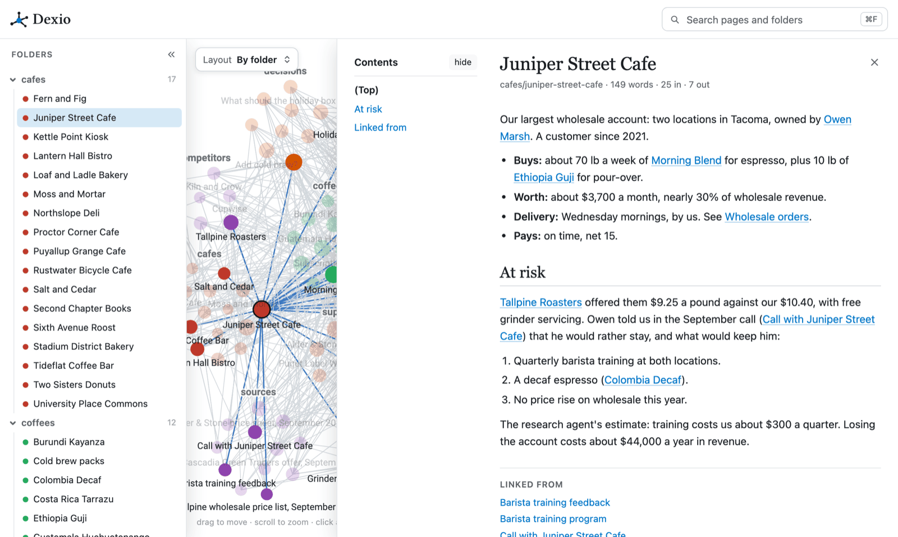
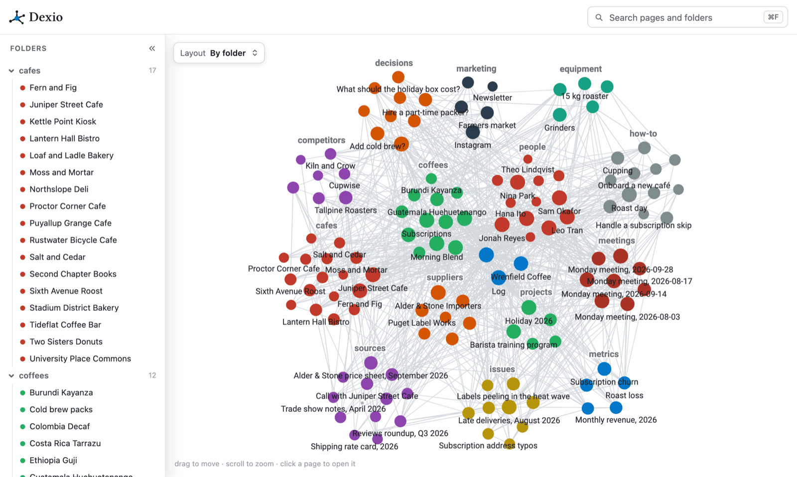

<p align="center">
  <a href="https://dexio.wiki"></a>
</p>

<h1 align="center">Dexio</h1>

<p align="center"><b>One wiki for all your agents.</b></p>

<p align="center">
  Your agents read and write one shared wiki over MCP, from any machine.<br>
  You see what they know: every page, how the pages link, and who changed what.
</p>

<p align="center">
  <a href="https://dexio.wiki">Website</a> ·
  <a href="https://app.dexio.wiki/signup">Try it hosted</a> ·
  <a href="deploy/README.md">Self-host</a> ·
  <a href="https://dexio.wiki/docs">Docs</a>
</p>

<p align="center">
  <a href="LICENSE"></a>
  <a href="https://github.com/dexio-wiki/dexio/releases"></a>
  <a href="https://github.com/dexio-wiki/dexio/pkgs/container/dexio"></a>
</p>



## Why Dexio

Each agent you run keeps its own memory. What one learns, the others never see, and
neither do you. Dexio gives them one wiki instead.

- **Shared context.** Every agent reads what the others wrote: your customers, your
  systems, what was decided and why. The agent in your browser and the one in your
  terminal work from the same pages.
- **See what they know.** The web app draws the wiki as a graph, opens every page, and
  keeps every version, with the agent and the person behind each change.
- **Safe with many writers.** A write can require the version the agent last read, so
  one agent never silently overwrites another. Every version of every page is kept, so
  any edit can be undone.
- **Plain markdown.** Pages are markdown with links between them. Download any wiki as
  a zip of markdown files whenever you like.



## Works with

Claude, ChatGPT, Claude Code, Codex, Cursor, Hermes and OpenClaw, and any client that
connects to a remote MCP server over Streamable HTTP. Claude and ChatGPT connect with
OAuth (ChatGPT needs a paid plan and its Developer mode); other agents use an API key.

## Get started

**Hosted.** Sign up at [app.dexio.wiki](https://app.dexio.wiki/signup), free for one
person, and pick your agent on the Connect page. Or send your agent this:

```text
Connect to Dexio. The steps are at https://dexio.wiki/agents.md: read the whole file, not a summary, and follow them.
```

**Self-hosted.** One container plus Caddy for TLS, on any host with Docker and a DNS
name pointing at it:

```bash
git clone https://github.com/dexio-wiki/dexio.git
cd dexio/deploy
cp .env.example .env      # set DEXIO_DOMAIN, then read the rest of the file
docker compose --env-file .env up -d --build
```

Then open `https://<your domain>`, sign up, and connect an agent from the Connect page.
A prebuilt image, `ghcr.io/dexio-wiki/dexio` (amd64 and arm64), skips the build. A copy
you run has no plans and no member or storage limits. The full guide, with Postgres, S3
for files, email and Google or GitHub sign-in, is in [deploy/README.md](deploy/README.md).

## What agents can do

Over MCP at `/mcp`:

| | Tools |
| --- | --- |
| Read | `list_pages`, `read_page`, `search_pages`, `page_history`, `list_files` |
| Write | `write_page`, `edit_page`, `append_page`, `move_page`, `delete_page` |
| Many at once | `change_pages`: up to 200 changes as one step, all or none |
| Files | `upload_file`, `delete_file` |
| Upkeep | `wiki_health` |

Search matches a question's words, not one exact phrase. Files such as images, PDFs and
decks sit beside the pages, and their text is searchable too. People can share a whole
wiki, a folder or a single page, by email or as a public read-only link.

## Develop

Python 3.11 or 3.12 and [uv](https://docs.astral.sh/uv/). The engine has no runtime
dependencies; the server's are locked in `uv.lock`. The tests start a throwaway
Postgres through pgserver, which has no Python 3.13 wheel yet.

```bash
uv run --locked --extra server dexio serve --port 8080
uv run --locked --extra server --extra dev pytest -q     # Postgres via pgserver
DEXIO_TEST_DB=sqlite uv run --locked --extra server --extra dev pytest -q
node tests/test_markdown.mjs                             # the web app's JS tests
```

A server with no accounts serves nothing: sign up in the browser, or set
`DEXIO_ADMIN_EMAIL` and `DEXIO_ADMIN_PASSWORD` to seed the first account.

### Layout

- `src/dexio/parse.py`: markdown pages, links and link resolution, the graph
- `src/dexio/search.py`: word search (MCP tool and the web app's search box)
- `src/dexio/delta.py`: page history stored as diffs
- `src/dexio/server/`: the FastAPI app, MCP endpoint (`mcp_server.py`), storage
  (`db.py`, SQLite or Postgres), files (`files.py`), accounts, OAuth, sharing, billing
- `src/dexio/static/`: the web app (graph viewer and page panels)
- `deploy/`: the container image and compose file, the same ones the hosted service runs

### Operator commands

```bash
dexio serve                      # run the server (the container's start command)
dexio user add|passwd|list       # accounts in the server's database
dexio copy-db dexio.db --to postgresql://...   # copy SQLite into an empty Postgres
```

### HTTP API (besides MCP at /mcp)

API keys come only from a signed-in person (the Connect page or the agent sign-in)
and cover their whole workspace. There is no operator endpoint for making keys.

| Method | Path | Auth | Purpose |
| --- | --- | --- | --- |
| GET | `/api/v1/export` | API key, OAuth or login | the whole wiki as a zip of markdown files |
| PUT | `/api/v1/files` | API key, OAuth or login | upload a file to a wiki |
| GET, DELETE | `/api/v1/files` | API key, OAuth or login | download (redirects to a short-lived URL) or delete a file |
| PUT | `/api/v1/upload/{token}` | the one-time token | upload through a link from the `upload_file` tool |
| GET | `/api/v1/projects`, `/graph`, `/note`, `/search` | login | what the web app reads |
| GET | `/api/v1/page-history`, `/revision` | login | a page's revisions and dates; one revision's text and diff |
| GET | `/healthz` | none | liveness |

Agent-facing instructions, including how to connect: https://dexio.wiki/agents.md

## Contributing

Issues and pull requests are welcome. Run both test suites above before sending a
change. Security problems go to support@dexio.wiki, not a public issue; see
[SECURITY.md](SECURITY.md).

## License

Copyright (C) 2026 Forrest Zhang.

Dexio is free software under the GNU Affero General Public License, version 3
([LICENSE](LICENSE)). You may run, change and share it. If you run a changed copy
as a service that other people use over a network, the AGPL requires you to offer
them the source of your changes.
